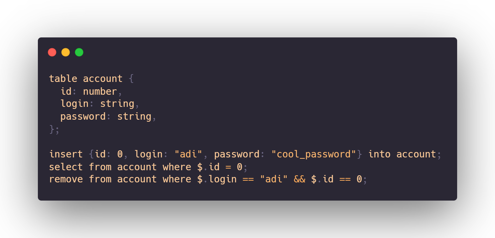

<p align="center"></img></p>
<h1 align="center"><a href="https://github.com/poiredb/poiredb">PoireDB - fast and easy Database Control System</a></h1>

<p align="center">
</img>
</img>
</img>
</img>
</img>
</img>
</p>

<p align="center"></img></p>

## Compiling on Windows

### Compiling PQL
Requirements: `Visual Studio, MSBuild, CMake, Golang`
```powershell
cd pql/
cmake -S . -B build/
cd build/
MSBuild.exe pql.sln
```
Then add all binaries into the `$PATH` environmental variable.

### Compiling PoireDB server
```powershell
cd ../..
go build cmd/poiredb
```

## On Linux
### Compiling PQL
Requirements: `Makefile, CMake, GCC`
```bash
cd pql/
cmake -S . -B build/
cd build/
make
```

Then for all binaries do:
```bash
sudo cp <binary> $HOME/bin/<binary>
```

### Compiling PoireDB server
Requirements: `Golang`
```bash
cd ../..
go build cmd/poiredb
```

## License
The project is currently under the [MIT license](https://github.com/PoireDB/PoireDB/blob/master/LICENSE).

## Documentation
All documentation can be found [here](https://github.com/PoireDB/PoireDB/wiki).